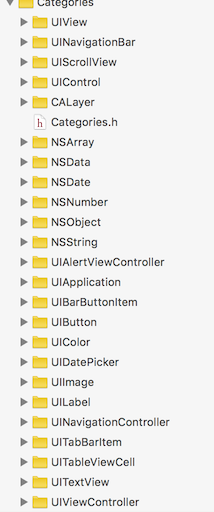
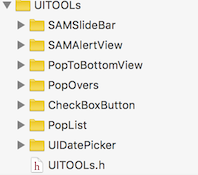

# SAMUIKitTools

##使用方法
使用CocoaPods
```objc
pod 'SAMUIKitTools', '~> 0.0.5'
```
	#import "SAMUIKitTools.h"


##SAMUIKitTools结构

### 目录结构


```
SAMUIKitTools

	├── Categories				#分类部分

	├── UITools           		 #UI部分       

	├── Categories.h     		  #分类部分头文件      
     
	├── UITools.h    				#UI部分头文件 

	└── SAMKeys.h      			#宏工具

```


###Categories部分

===
 

收录的分类有如下部分

[`NSObject`](https://github.com/ISMeSAM/SAMUIKitTools/tree/master/SAMUIKitTools/Categories/NSObject),
[`UIImage`](https://github.com/ISMeSAM/SAMUIKitTools/tree/master/SAMUIKitTools/Categories/UIImage),
[`UIButton`](https://github.com/ISMeSAM/SAMUIKitTools/tree/master/SAMUIKitTools/Categories/UIButton),
[`UIColor`](https://github.com/ISMeSAM/SAMUIKitTools/tree/master/SAMUIKitTools/Categories/UIColor),
[`UILabel`](https://github.com/ISMeSAM/SAMUIKitTools/tree/master/SAMUIKitTools/Categories/UILabel),
[`UIBarButtonItem`](https://github.com/ISMeSAM/SAMUIKitTools/tree/master/SAMUIKitTools/Categories/UIBarButtonItem),
[`UINavigationController`](https://github.com/ISMeSAM/SAMUIKitTools/tree/master/SAMUIKitTools/Categories/UINavigationController),

[`UIViewController`](https://github.com/ISMeSAM/SAMUIKitTools/tree/master/SAMUIKitTools/Categories/UIViewController),
[`UIView`](https://github.com/ISMeSAM/SAMUIKitTools/tree/master/SAMUIKitTools/Categories/UIView),
[`NSNumber`](https://github.com/ISMeSAM/SAMUIKitTools/tree/master/SAMUIKitTools/Categories/NSNumber),
[`UITableViewCell`](https://github.com/ISMeSAM/SAMUIKitTools/tree/master/SAMUIKitTools/Categories/UITableViewCell),
[`CALayer`](https://github.com/ISMeSAM/SAMUIKitTools/tree/master/SAMUIKitTools/Categories/CALayer),
[`NSDate`](https://github.com/ISMeSAM/SAMUIKitTools/tree/master/SAMUIKitTools/Categories/NSDate),
[`UITabBarItem`](https://github.com/ISMeSAM/SAMUIKitTools/tree/master/SAMUIKitTools/Categories/UITabBarItem),

[`UIApplication`](https://github.com/ISMeSAM/SAMUIKitTools/tree/master/SAMUIKitTools/Categories/UIApplication),
[`NSArray`](https://github.com/ISMeSAM/SAMUIKitTools/tree/master/SAMUIKitTools/Categories/NSArray),
[`UITextView`](https://github.com/ISMeSAM/SAMUIKitTools/tree/master/SAMUIKitTools/Categories/UITextView),
[`UIAlertController`](https://github.com/ISMeSAM/SAMUIKitTools/tree/master/SAMUIKitTools/Categories/UIAlertController),
[`UIView`](https://github.com/ISMeSAM/SAMUIKitTools/tree/master/SAMUIKitTools/Categories/UIView),
[`UIControl`](https://github.com/ISMeSAM/SAMUIKitTools/tree/master/SAMUIKitTools/Categories/UIControl),

[`UINavigationBar`](https://github.com/ISMeSAM/SAMUIKitTools/tree/master/SAMUIKitTools/Categories/UINavigationBar),
[`UIScrollView`](https://github.com/ISMeSAM/SAMUIKitTools/tree/master/SAMUIKitTools/Categories/UIScrollView),


### &&
[一些宏工具](https://github.com/ISMeSAM/SAMUIKitTools/blob/master/SAMUIKitTools/SAMKeys.h)


###UITools部分

===
 


* SAMPopToStatusBarView
* SAMPopLists
* SAMDatePicker
* SAMPopToBottomView
* SAMPopAtBottomView
* SAMAlertView
* SAMSlideBar left
* SAMSlideBar right

###特别声明

==
[`SAMUIKitTools`](https://github.com/ISMeSAM/SAMUIKitTools)仅供学习和交流,如有任何问题和建议请联系作者

致力于构建 iOS 开发方便快捷的工具库,让开发变得更加`简单`,`轻松`,`高效`


* 如果在使用[`SAMUIKitTools`](https://github.com/ISMeSAM/SAMUIKitTools)过程中遇到BUG，希望你能Issues我，谢谢（或者尝试下载最新的框架代码看看BUG修复没有）
* 如果在使用[`SAMUIKitTools`](https://github.com/ISMeSAM/SAMUIKitTools)过程中发现功能不够用，希望你能Issues我，我非常想为这个框架增加更多好用的功能


